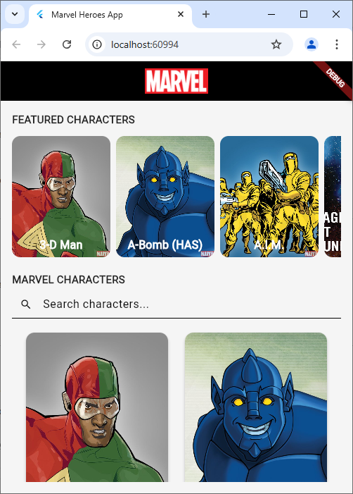

# 💥 marvel_app

Aplicativo de personagens da Marvel, feito com Flutter Web 🕸️🦸‍♂️

---

## 🚀 Getting Started

Para rodar o projeto, você precisa:

- 🛠️ Ter o Flutter instalado: [Guia oficial de instalação](https://docs.flutter.dev/get-started/install)

---

## 🔐 Segurança das chaves da API

Este projeto consome a API da Marvel, que requer o uso de uma **chave pública** e uma **chave privada**.  
Por motivos de segurança e boas práticas, **as chaves reais não estão incluídas no repositório**.

---

### ⚙️ Como configurar

1️⃣ Crie um arquivo `.env` na raiz do projeto com o seguinte conteúdo:

```env
MARVEL_PUBLIC_KEY=sua_chave_publica
MARVEL_PRIVATE_KEY=sua_chave_privada
```

🔗 Você pode obter suas chaves em: https://developer.marvel.com

2️⃣ Gere o arquivo de configuração necessário com o comando:

```
dart tool/env_generator_from_dotenv.dart
```
Isso criará o arquivo lib/core/secrets.dart automaticamente.

3️⃣ Em seguida, rode o projeto:
```
flutter run -d chrome
```

E pronto! Se tudo der certo você deve ver esta página:

